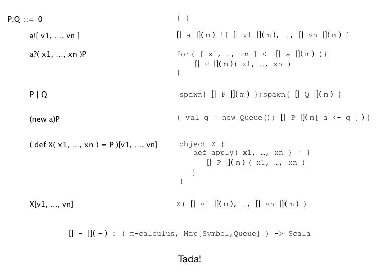

*********************************************
Primitives, Builtins, and Foreign Functions
*********************************************

One of the most important aspects of the reflective semantic model is
that it affords a modular treatment of primitive data types such as
booleans, string, numeric, and collection types, and the host of other
data types that make a modern language usable by modern standards. This
comes about in a way that will make the Lisp programmer smile: data is
code and code is data. Reflection provides a rational framework for this
well loved and heavily used duality between code and data. In the
concurrency setting this formulation amounts to saying that all data are
processes. Numbers, strings, logical values, all of these familiar
elements of modern programs are processes. However, because we can ship
processes around as if they were data, we can effect the natural usage
patterns of passing values as if they were data.

From a historical perspective it is important to note that while the
untyped functional programming languages, such as Lisp and Scheme,
wholeheartedly embraced the data/code duality and used it to provide
highly sophisticated meta-programming capabilities, it was much longer
before this was embraced by typed languages, let alone the typed
functional languages. Java was arguably the first mainstream language to
adopt a typed reflective model, and typed reflection functional
languages are still far behind Java’s level of maturity, though Scala is
definitely gaining ground here. Rholang steps past Scala by being the
first programming language ever to provide a typed reflective model of
computation that takes concurrent execution as the primitive engine of
computation. In fact, it is the only language with all of these elements
combined into a single language design.

Because it seeks to be a general purpose programming language -- that
just happens to run on a computer whose state is stored on the
blockchain -- it needs to have a rich set of data types, builtins, as
well as a means to plug in new data types and builtins coming from
external or third party components, such as linear algebra packages
(like BLAS or LAPACK), or SAT-solvers or any of a number of other useful
computational libraries that will ease the job of writing powerful
applications and contracts. Following Milner’s lead, we note that
functions are processes! Further, because we can pass processes as data
we get higher-order function-passing capabilities for free.

Realizing the builtin data types and operations as builtin processes not
only makes the language easily extensible, it also allows for a
modularization of the semantics. Since logical, arithmetic, string, and
collection operations, along with the corresponding data elements on
which they operate, are realized as a set of builtin processes the
semantics can be factored cleanly into the core semantics that says
quite generally how processes compute and a set of builtin processes for
the primitive operations. This modularity makes it easy to maintain and
evolve Rholang. For example, a first implementation might not come with
bignums. Adding bignums can be as simple as providing the set of
primitive processes that implement the bignum representation together
with the set of transduction processes that convert between bignums and
the other numeric types.

We feel that this kind of modularity is critical in a open-source
environment, especially one such as we find with cryptocurrency and the
blockchain, where many parties will look at providing different, and
possibly slightly differentiated implementations of the specification.
Modularity makes it possible to have a unified substrate with high level
feature differentiation amongst many implementations of the language.

An example from arithmetic

Lest this seem terribly abstract, let us consider a simple example, such
as addition. Just as with modern functional languages, we recognize that
an expression like m + n is never really outside of an evaluation
context. There is always some continuation that is waiting for the
result of this expression, whether it is the REPL prompt or the storage
of the result in a variable. Once we understand that there is some
waiting continuation, say P, we can model the passage of the result to
the continuation as

 for(result <- k)P

Now, let us imagine we have a function, written [\| e \|](k), which
translates an arithmetic expression e into a process that will evaluate
e and pass the result along the channel k. Then, the expression that
evaluates e and passes it to the awaiting continuation P is just

for(result <- k)P \| [\| e \|](k)

If we adopt the convention that [\| e \|] denotes the value of e, then
the expression above becomes

for(result <- k)P \| k!([\| e \|])

Thus, if e is m+n, we have

for(result <- k)P \| k!([\| m+n \|])

Now we can recurse, compositionally evaluating m, n and +.

for(result <- k)P

\| k!(new kp in kp!([\| m \|]) \| kp!([\| n \|]) \| [\| + \|](kp))

Now, suppose

[\| + \|](kp)= for(m <- kp; n <- kp){ *m+n* }

where *m+n* denotes the primitive process representation of m+n. To be
more specific, since Alonzo Church showed how to encode the natural
numbers and arithmetic into the lambda calculus, it has become common
practice to study various encodings of arithmetic in various
computational calculi. In the polyadic π-calculus tutorial, for example,
Milner gives a natural and direct encoding of the naturals and
arithmetic into the π-calculus. Because the π-calculus can be faithfully
encoded into the rho-calculus and Rholang is merely syntactic sugar for
the rho-calculus, we can transport Milner’s encoding directly to this
setting. Alternatively, Meredith has given an encoding of Conway games
into rho-calculus, providing the basis for a Rholang bignum package that
includes the transfinites and the infinitesimals! Further still, this
particular encoding for addition can be seen as part of a recursive
Church-numeral-like encoding that bottoms out with the stopped process
representing the number 0. As interesting as these various approaches
are, the details are not salient to the example. There are lots of ways
to provide a Church-numeral-like representation of m+n. As such, we
simply assume that there is a faithful representation of the value of
m+n as a process *m+n*.

Before moving on it is interesting to note one key feature of this
encoding. The values for m and n are arriving on kp in parallel. As
such, what is bound to the *variable* m could be *m* or *n*. If it turns
out that *n* is bound to m, then *m* will be bound to the variable n.
So, the expression *m+n* will evaluate either *m+n* to or *n+m*. Because
addition is commutative these are the same. Were the operation
noncommutative, such as matrix multiplication, we could sequentialize
the communication to ensure that the arrival order was deterministic and
fixed and thus respect the intended semantics of the expression. In
fact, the interested reader is encouraged to modify the definition to
provide the appropriate sequentialization to get a feel for the
language. The main point here though, is that we don’t have to and as
such have access to a much wider range of optimization and performance
improvements in our compilation strategies.

Now, equipped with the process *m+n*, the resulting expression looks
like

for(result <- k)P

\| k!(new kp in kp!([\| m \|]) \| kp!([\| n \|]) \| for(m <- kp; n <-
kp)(\ *m+n*))

which then evaluates to

P{@(new kp in kp!([\| m \|]) \| kp!([\| n \|]) \| for(m <- kp; n <-
kp)(\ *m+n*))/result}

Any usage context in P of the form \*result will deliver the desired
result, namely *m+n*. To see this let’s consider the simplest possible
example. Suppose that P = \*result. Then we will get

\*result{ @(new kp in kp!([\| m \|]) \| kp!([\| n \|]) \| for(m <- kp; n
<- kp)(\ *m+n*))/result}

=

new kp in kp!([\| m \|]) \| kp!([\| n \|]) \| for(m <- kp; n <-
kp)(\ *m+n*)

->

new kp in *m+n*

Since kp is never mentioned in *m+n*, it may be garbage collected,
resulting in

*m+n*

There are a few points worth calling out in this implementation. First,
this implementation resembles nothing so much as a register machine
pushing m and n into a register kp, and then having the addition
operation + pop the register to perform the add op. As such, a compiler
would be well in its rights to compile to just such an implementation
scheme.

Second, most programmers don’t care about the internal representation.
They just want to make sure that when they store 5 in a variable x, i.e.
they publish the value 5 to the location associated with the channel x,
and they store 7 in a variable y, likewise publishing 7 to channel y,
when they add x and y, i.e. read from channels x and y and adding the
results, they get 12. Yet, reflection coincides with this very pragmatic
outlook. The *numeral* 5 can be viewed as the code for the process that
represents the *number* 5 represents. If m and n are respectively 5 and
7, then @(m+n) is the code for the process representing the number
indicated by 5+7. Arguably, the *numeral* 12 (or 1010 in binary or 14 in
octal or … ) is most natural code for the process representing the
*number* represented by 5+7. More generally, the most natural
implementation of an expression like @(m+n) is simply the corresponding
numeral.

Third, the implementation is lazy. It defers the actual calculation of
the addition until the point at which the value is needed. Languages
like Haskell, and to some extent Scala, have made a successful case for
lazy evaluation. It is important to ensure, however, that such lazy
evaluation schemes are not brittle, in the sense that a small change in
the representation of a data structure constitutes a non-local change to
the computational complexity of a program that has some ultimate
dependency on the data structure. This is a criticism that Haskell
suffers. Here, however, the laziness is effectively a compile-time
rather than runtime phenomenon, in the sense that a good optimizing
compiler could analyze the contents of the publication on k and reduce
it directly the value it represents, without negative impact on the
code. Thus, it is arguably less susceptible to the kind of lazy
evaluation brittleness found in Haskell.

Modularity, efficient implementation, and scalable verification

In this connection, it is important to understand that this example is
primarily to show how easy it is to model and integrate primitives,
builtins, and foreign functions. It is not necessary to spin up the
*four threads* executing in this translation just to effect an addition!
Any reasonable implementation will likely effect the whole operation by
mapping it to native execution, such as a JVM or LLVM operation, or
whatever the compilation target might be. However, a non-native
implementation and semantics can always be provided.

The ability to have process level and/or native level representations of
various data types and operations should be familiar to those people who
have worked with managed code environments like the JVM or the CLR.
Boxing and unboxing in those settings is an instance of the same
phenomenon. This feature allows for modular reasoning about the
correctness of the language implementation as a whole, and thus the
correctness of contracts with dependencies on various modules providing
primitives data types and operations.

Specifically, correctness can be reasoned about on a module by module
basis, which is critically important for a practical formal verification
programme to work. It would be impossible to release an implementation
of Rholang if all primitives and operations, from floating point
arithmetic to date-time operations, had to be formally verified correct
first. These are extremely large surface areas and notoriously difficult
to verify. However, because Rholang’s semantics is modularly organized,
an implementation that relies on a native, formally verified arithmetic
library or module, will enjoy the confidence that the questions about
the correctness of contracts using (only) that library will be limited
to the contract implementations themselves.

Semantics
===========

A specification of the rho-calculus with summation

What follows is a minimal specification of the reflective higher-order
π-calculus (aka rho-calculus) with summation.

Syntax

M,N ::= 0          // nil or stopped process

       \|   for( x1 <- y1; … ; xN <- yN )P          // input guarded
agent

 \| x!( P ) // output

       \|   M+N       // summation or choice

P,Q  ::= M          // "normal" process

 \|   \*x          // dereferenced or unquoted name

       \|    P\|Q        // parallel composition

x,y ::= @P          // name or quoted process

Free and bound names

FN( 0 ) = {}

FN( \*x ) = { x }

FN( for( x1 <- y1; … ; xN <- yN )P )

= { x1, … , xN } U FN( P ) \\ { y1, … , yN }

FN( x!( P ) ) = { x } U FN( P )

FN( M+N ) = FN( M ) U FN( N )

FN( P\|Q ) = FN( P ) U FN( Q )

Write the reduction rules. This spec isn’t useful yet because it doesn’t
specify how to

Structural equivalence

Structural equivalence is the smallest congruence, =\ :sub:`S`, such
that

-  (P,\|,0) form a commutative monoid

-  (P,+,0) form a commutative monoid

-  If =\ :sub:`N` denotes name-equivalence, then =\ :sub:`S` includes
   the alpha-equivalence using =\ :sub:`N`

Name equivalence

Name equivalence is the smallest equivalence on names such that

P =\ :sub:`S` Q => @P =\ :sub:`N` @Q

Semantic versus syntactic substitution

See: \ `*L. Gregory
Meredith* <http://docs.google.com/m/Meredith:L=_Gregory.html>`__,
Matthias Radestock: A Reflective Higher-order Calculus. \ `*Electr.
Notes Theor. Comput. Sci.
141* <http://docs.google.com/db/journals/entcs/entcs141.html#MeredithR05>`__\ (5):
49-67 (2005)

for a detailed account. Terms of the form \*x are taken to Q when a
substitution of the form { @Q/u } is applied and x =\ :sub:`N` u.

Reduction relation

comm: xi =\ :sub:`N` xi’ => R + for( x1 <- y1; … ; xN <- yN )P + S \|
x1’!( Q1 ) \| … \| xN’!( QN ) -> P{ @Q1/y1, … , @QN/yN }

par: P -> P' => P\|Q -> P'\|Q

struct: P = P', P' -> Q', Q' = Q => P -> Q

Guidance for implementations

Ignoring the nuances around the structure of names, here is a perfectly
reasonable rendering of the core concurrency semantics into Scala code.

|image5|

